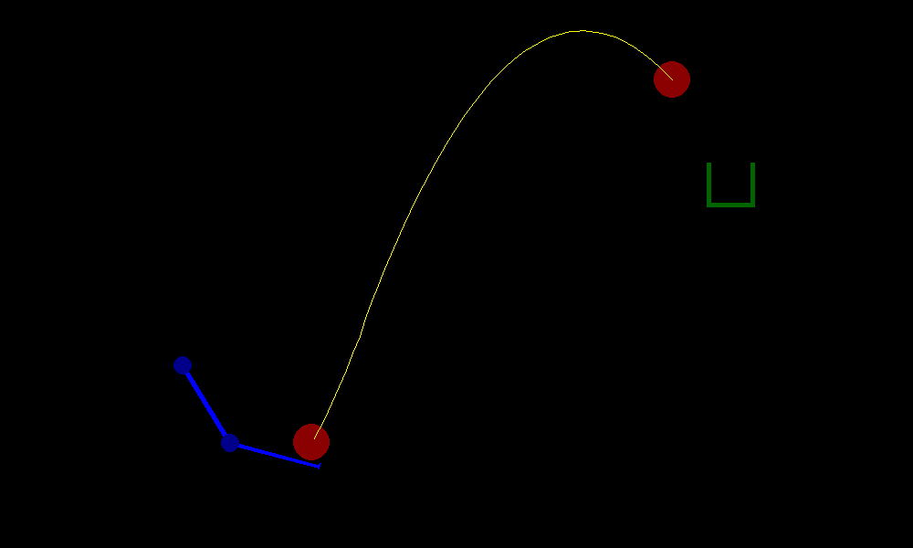

# Basketball shooter

A Gymnasium-type environment to simulate a two-joint robotic arm throwing a ball to hit a basket.



The supported rendering modes:

| Mode   | Meaning                              |
|:-------|--------------------------------------|
| human  | Real-time rendering using PyGyme.    |
| png    | Save individual frames as PNG files. |
| None   | Console only, maximum speed.         |

Interaction:

| Space       | Type                                |
|:------------|:------------------------------------|
|Action       | Box(-1.0, 1.0, (2,), float32)       |
|Observation  | Box(-np.inf, np.inf, (4,), float32) |
|Reward       | {0, 1}                              |

The episode length is 300 steps by default. An episode is terminated when the ball hits the basket or falls to the ground. When the ball first starts moving upwards, a trajectory is being drawn until the end of the episode.

### Actions and observations

Actions control the speeds of the two joints (upper and lower). A positive value denotes CCW rotation, a negative value CW rotation.

Observations are the following:

| Index | Quantity                                                                 |
|:-----:|:-------------------------------------------------------------------------|
|0      | Orientation of the upper joint: [-180, 180]                              |
|1      | Orientation of the lower joint, relative to the upper joint: [-180, 180] |
|2      | Position x of the ball in meters: (-inf, inf)                            |
|3      | Position y of the ball in meters: (-inf, inf)                            |

### Reward

Reward is 0 if the basket has not been, 1 otherwise. Reward of 1 can only be obtained in the final step of the episode.

## Usage

Install the Python package with:

`pip install gymnasium_qr@git+https://github.com/DomenSoberl/gymnasium_qr`

A minimum example with random actions:

```
import gymnasium as gym
import gymnasium_qr

env = gym.make("gymnasium_qr/BasketballShooter-v0", render_mode="human")

for episode in range(10):
    observation, info = env.reset()

    episode_over = False
    while not episode_over:
        action = env.action_space.sample()
        observation, reward, terminated, truncated, info = env.step(action)
        episode_over = terminated or truncated

env.close()
```

## Custom settings

See the `examples/change_options.py` example for defining the `options` structure. Pass it to the `make` function to permanently set up the environment: 

```
env = gym.make(
    "gymnasium_qr/BasketballShooter-v0",
    render_mode="human",
    options=custom_options
)
```

Or to the `reset` method to override the settings for one episode only:

```
observations, info = env.reset(options=custom_options)
```

## Wrappers

### One shoot

A simplified experimental setup, where only one action of a certain duration is executed at the start of the episode. The action is given with the `reset` method. The `action` parameter given with the `step` function is ignored. Custom settings are partially overridden when given with the `make` method, and ignored if given with the `reset` method.

Example:

```
env = gym.make("gymnasium_qr/BasketballShooter-v0", render_mode="human")
env = OneShotScenario(env)

observation, info = env.reset(
    options={
        'action': [0.61, -0.44],
        'duration': 20
    }
)

episode_over = False
while not episode_over:
    observation, reward, terminated, truncated, info = env.step(action=None)
    episode_over = terminated or truncated
```

### Trajectory observer

Extends the observations with two additional variables:

| Index | Quantity                                                                    |
|:-----:|:----------------------------------------------------------------------------|
|4      | The maximum height reached by the ball: [0, np.inf]                         |
|5      | The horizontal position of the ball at the highest point: [-np.inf, np.inf] |
|6      | The horizontal velocity of the ball at the highest point: [-np.inf, np.inf] |

The maximum height is being observed only while the trajectory is being recorded. That is from the moment the ball first moves upwards until either the ball touches the basket (collision) or the episode ends. It is possible that the trajectory is not recorded at all, i.e. if the arm fails to accelerate the ball upwards. In this case, all the values are 0.

Example:

```
env = gym.make("gymnasium_qr/BasketballShooter-v0", render_mode="human")
env = TrajectoryObserver(env)
env.reset()

episode_over = False
while not episode_over:
    action = env.action_space.sample()
    observation, reward, terminated, truncated, info = env.step(action)
    episode_over = terminated or truncated

print(f'Top point was ({observation[4]} m, {observation[5]} m), with vertical speed {observation[6]} m/s.')
```

### No basket

This wrapper removes the basket from the experimental setup. The coordinates are still there and the distance of the ball from the basket is still returned by the 'info' method, but it's physical manifestation is removed from the world.

Usage:

```
from gymnasium_qr.wrappers import NoBasket

env = gym.make("gymnasium_qr/BasketballShooter-v0", render_mode="human")
env = NoBasket(env)
```

The rest of the functionality is equivalent to the original class.
